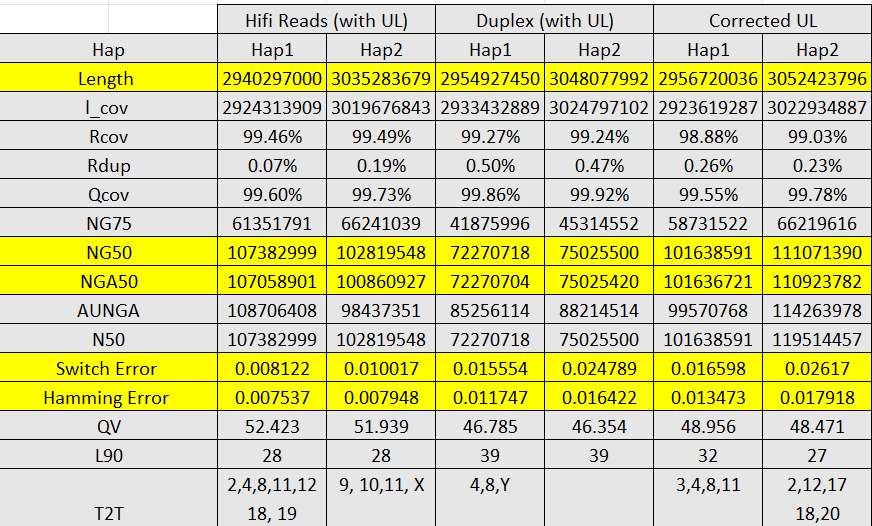
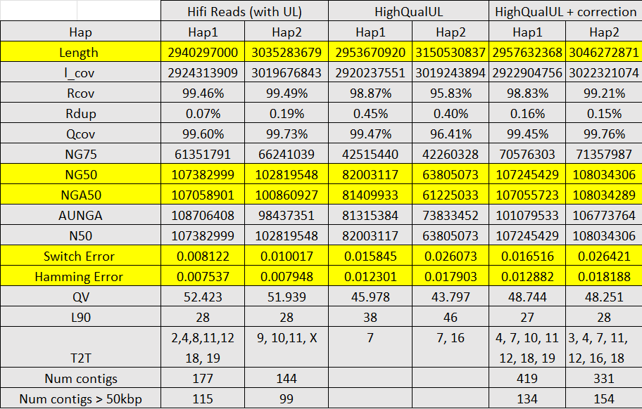

# HERRO

HERRO (Haplotype-aware ERRor cOrrection)  is a highly accurate, haplotype-aware, deep-learning tool for error correction of Nanopore R10.4.1, Kit 14 reads (length of ≥ 10000bp is recommended). An experimental model for R9.4.1 data is also provided for download.

## Requirements

- Linux OS (tested on RHEL 8.6 and Ubuntu 22.04)
- [Zstandard](https://facebook.github.io/zstd/)
- Python (and conda) for data preprocessing


## Installation

### Install with Conda

1. Clone the repository and change directory 

   ```shell
   git clone https://github.com/dominikstanojevic/herro.git
   cd herro
   ```

2.  Create  the conda environment with the provided *herro-env.yml* on `scripts/` directory

    ```shell
    conda env create --file scripts/herro-env.yml
    ```

### Use the pre-built Singularity image ( can be used with Apptainer as well) 

* Pre-built image can be downloaded as below 

    ```shell
    wget -O herro.sif https://zenodo.org/records/13148100/files/herro.sif?download=1
    ```
    

* If you would like the build the container image yourself, we provide the *herro-singularity.def* file. Image can be built with the following command ( assuming you have `sudo` permissions for the machine you work with.)

    ```shell
    sudo singularity build herro.sif herro-singularity.def
    ```
    
    Run the tool (see [Usage](#usage)) with: ```singularity run --nv --bind <host_path>:<dest_path> herro.sif inference <args>```


### Compile from source ( In case you don't prefer `conda` or Container option)
    
* **Dependencies**

  - [libtorch 2.0.*](https://download.pytorch.org/libtorch/cu117/libtorch-shared-with-deps-2.0.1%2Bcu117.zip)
  - [rustup](https://rustup.rs/)


    
* When compiling from source, ensure that libtorch and rustup are downloaded and installed.

    ```shell
    export LIBTORCH=<libtorch_path>
    export LD_LIBRARY_PATH=$LIBTORCH/lib:$LD_LIBRARY_PATH
    RUSTFLAGS="-Ctarget-cpu=native" cargo build -q --release
    ```
    Path to the resulting binary: ```target/release/herro```

## Model Download

  1. Download model:
     
  For R10.4.1 data,
  ```shell
  wget -O model_R10_v0.1.pt https://zenodo.org/records/12683277/files/model_v0.1.pt?download=1
  ```
  For R9.4.1 data (experimental),
  ```shell
  wget -O model_R9_v0.1.pt https://zenodo.org/records/12683277/files/model_R9_v0.1.pt?download=1
  ```

Models can also be found on Zenodo: [https://zenodo.org/records/12683277](https://zenodo.org/records/12683277)

## Usage

1. Preprocess reads
```shell
scripts/preprocess.sh <input_fastq> <output_prefix> <number_of_threads> <parts_to_split_job_into>
```
Note: Porechop loads all reads into memory, so the input may need to be split into multiple parts. Set <parts_to_split_job_into> to 1 if splitting is not needed. In Dorado v0.5, adapter trimming was added, so adapter trimming and splitting using Porechop and duplex tools will probably be removed in the future.

2. minimap2 alignment and batching

Although minimap2 can be run from the ```herro``` binary (omit --read-alns or use --write-alns to store batched alignments for future use), the preferred method is to initially run minimap2 and then utilize it to generate alignment batches. These batches will be used as input for the ```herro``` binary.

```shell
scripts/create_batched_alignments.sh <output_from_reads_preprocessing> <read_ids> <num_of_threads> <directory_for_batches_of_alignments> 
```
Note: Read ids can be obtained with seqkit: ```seqkit seq -ni <reads> > <read_ids>```

3. Error-correction
```shell
herro inference --read-alns <directory_alignment_batches> -t <feat_gen_threads_per_device> -d <gpus> -m <model_path> -b <batch_size> <preprocessed_reads> <fasta_output> 
```
Note: GPUs are specified using their IDs. For example, if the value of the parameter -d is set to 0,1,3, herro will use the first, second, and fourth GPU cards. Parameter ```-t``` is given **per device** - e.g., if ```-t``` is set to ```8``` and 3 GPUs are used, herro will create 24 feature generation theads in total. Recommended batch size is 64 for GPUs with 40 GB (possibly also for 32 GB) of VRAM and 128 for GPUs with 80 GB of VRAM. 

## Citing HERRO

> Stanojevic, D., Lin, D., Florez De Sessions, P., & Sikic, M. (2024). Telomere-to-telomere phased genome assembly using error-corrected Simplex nanopore reads. bioRxiv, 2024-05. [doi:10.1101/2024.05.18.594796](https://doi.org/10.1101/2024.05.18.594796)

## Results on HG002 data

HG002 data was assembled using hifiasm and compared to HiFi reads. Results for uncorrected reads are not given since they produce poor assembly. Currently, data is not publicly available.

Assembly results and comparison with Hifi reads and uncorrected UL are given in the table below. Assemblies were perform using:

1. Hifi reads/Duplex ONT reads/Corrected UL reads
2. Uncorrected Ultra-long ONT reads as UL reads
3. Parental Illumina data

Hifiasm command used for all experiments:
```shell
hifiasm -o <output_prefix> -t <num_threads> --ul <UL_reads> --ul-cut 10000 -1 <parent1_yak> -2 <parent2_yak> <HiFi/Duplex/Corrected UL reads>
```

### Results




## Results on Error-corrected HG002 experimental, high-accuracy, UL data

Experimental high-accuracy, UL HG002 error-corrected reads can be downloaded as below. 
Raw data used for the error-correction can be found [here](https://labs.epi2me.io/gm24385_ncm23_preview/). Assemblies were done in the same way as in the previous section.

### Download
  1. Download error-corrected reads:
  ```shell
  wget -O HG002.experimentalUL.corrected.fasta.gz https://zenodo.org/records/13252378/files/HG002.experimentalUL.corrected.fasta.gz?download=1
  ```

### Results

Assembly results and comparison with Hifi reads and uncorrected UL are given in the table below. Assemblies were perform using:

1. Hifi/HQ Uncorrected UL/Corrected UL reads
2. HQ Uncorrected Ultra-long ONT reads as UL reads
3. Parental Illumina data




## Acknowledgements

This work has been supported by AI Singapore 100 Experiments (100E) Programme under the project AI-driven De Novo Diploid Assembler (AISG2-100E-2021-076) in collaboration with Agency for Science, Technology and Research (A*STAR), and Oxford Nanopore Technologies plc. (ONT).
